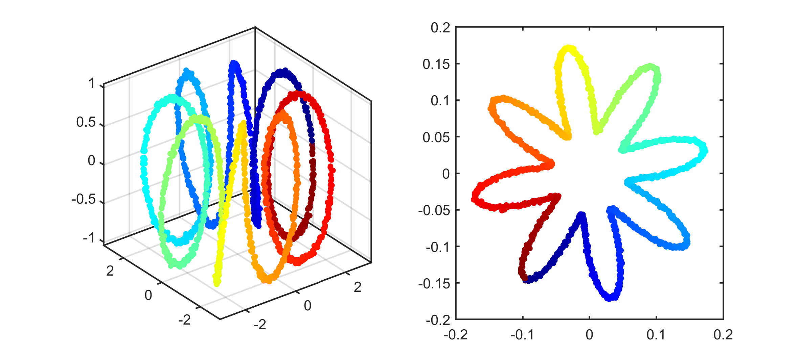
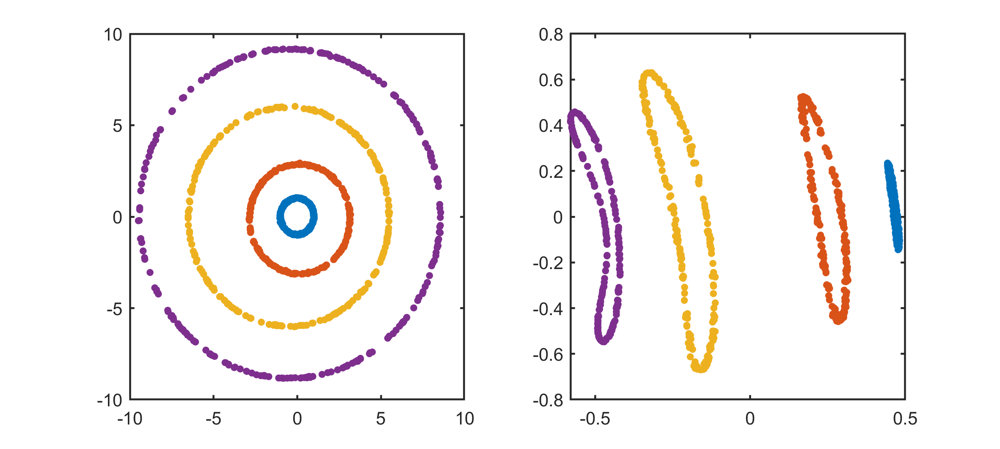
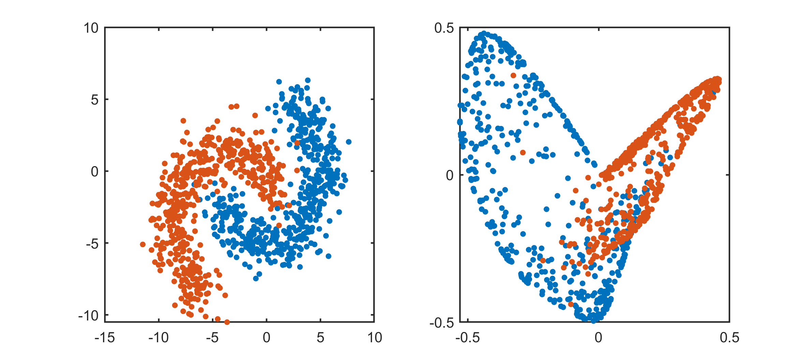
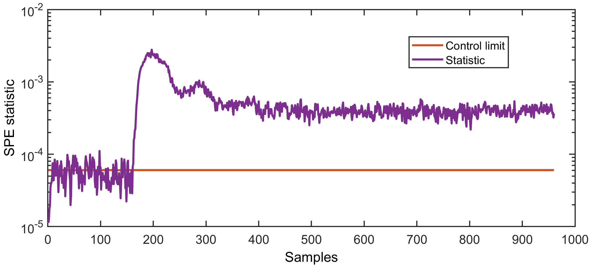
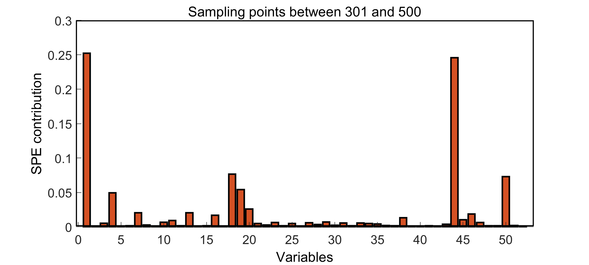
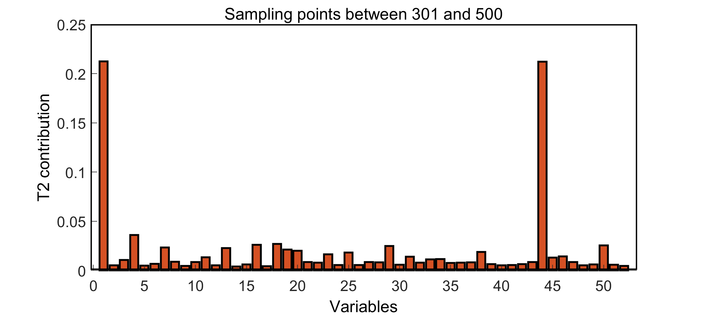
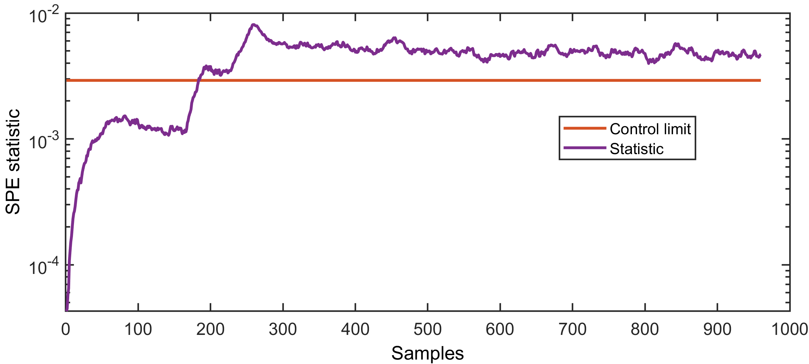
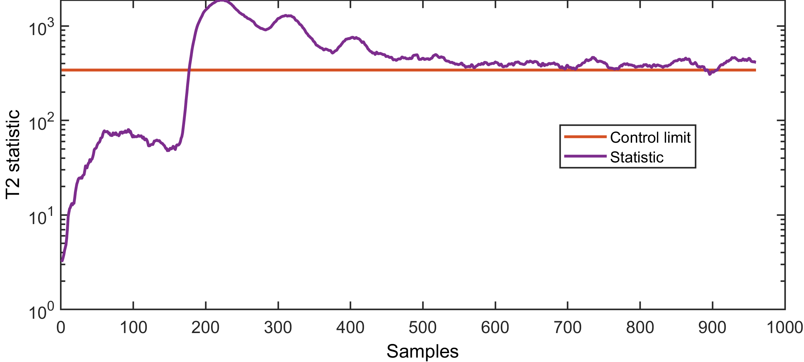

# Kernel Principal Component Analysis(KPCA)  
[](https://ww2.mathworks.cn/matlabcentral/fileexchange/69378-kernel-principal-component-analysis-kpca)
---------------------------------------------------------------
Updated on 16 Nov 2019	
1. Used OOP to rewrite some modules.
2. Added support for multiple kernel functions.
3. Fixed some bugs.
4. Accelerated the running speed of the fault diagnosis module 
---------------------------------------------------------------  

Notice
1. For a brief introduction to this code, please read 'contents.m' file.
2. Fault diagnosis module only supports gaussian kernel function at this version.
3. The fault diagnosis module calls the precompiled file '.mexw64' to accelerate the running speed.
4. Class is defined using 'Classdef...End', so this code can only be applied to MATLAB after the R2008a release.

---------------------------------------------------------------
### Demo for dimensionality reduction (helix data)  

```
clc
clear all
close all
addpath(genpath(pwd))

% load the training data
load('.\data\helix.mat')
traindata = helix;

% create a parameter structure for the KPCA application
application = struct('type','dimensionalityreduction',...
                     'dimensionality', 2);

% create an object for kernel function
kernel = Kernel('type', 'gauss', 'width', 24);

% create an object for kpca model
kpca = KpcaModel('application', application,...
                 'kernel', kernel);

% train KPCA model
model = kpca.train(traindata);

% get the mapping data
mappingdata = model.mappingdata;

% plot the mapping data (only support for 2D or 3D data)
plotMappingData(traindata, mappingdata);
```

  
### Demo for dimensionality reduction (circle data)  

```
clc
clear all
close all
addpath(genpath(pwd))

% load the training data
load('.\data\circledata.mat')
traindata = circledata;

% create a parameter structure for the KPCA application
application = struct('type','dimensionalityreduction',...
                     'dimensionality', 2);

% create an object for kernel function
kernel = Kernel('type', 'gauss', 'width', 6);

% create an object for kpca model
kpca = KpcaModel('application', application,...
                 'kernel', kernel);

% train KPCA model
model = kpca.train(traindata);

% get the mapping data
mappingdata = model.mappingdata;

% plot the mapping data (only support for 2D or 3D data)
plotMappingData(traindata, mappingdata, label);
```


### Demo for dimensionality reduction (banana data)  


### Demo for Fault Dection (using TE process data)

```
clc
clear all
close all
addpath(genpath(pwd))

% load the original process data of the TE process
load('.\data\teprocess.mat')

% normalization (in general, this step is important for fault detection)
[traindata, testdata] = normalize(traindata, testdata);

% create a parameter structure for the KPCA application
application = struct('type','faultdetection',...
                     'cumulativepercentage', 0.75,...
                     'significancelevel', 0.95);

% create an object for kernel function
kernel = Kernel('type', 'gauss', 'width', 800);

 
% create an object for kpca model
kpca = KpcaModel('application', application,...
                 'kernel', kernel);
% train kpca model
model = kpca.train(traindata);

% test KPCA model
testresult = kpca.test(model, testdata);

% visualize the testing results
plotTestResult(model.spelimit, testresult.spe, 'SPE');
plotTestResult(model.t2limit, testresult.t2, 'T2');
```
```
*** Detection finished ***
Testing samples number:  960 
T2 alarm number      :  799 
SPE alarm number     :  859 
```

  

### Demo for Fault Diagnosis (using TE process data)

```
clc
clear all
close all
addpath(genpath(pwd))

% load the original process data of the TE process
load('.\data\teprocess.mat')

% normalization (in general, this step is important for fault detection)
[traindata, testdata] = normalize(traindata, testdata);

% create a parameter structure for the KPCA application
application = struct('type','faultdetection',...
                     'cumulativepercentage', 0.75,...
                     'significancelevel', 0.95,...
                     'faultdiagnosis','on',...
                     'diagnosisparameter', 0.7);
   
% create an object for kernel function
kernel = Kernel('type', 'gauss', 'width', 800);

 
% create an object for kpca model
kpca = KpcaModel('application', application,...
                 'kernel', kernel);
% train kpca model
model = kpca.train(traindata);

% test KPCA model
testresult = kpca.test(model, testdata);

% visualize the testing results
plotTestResult(model.spelimit, testresult.spe, 'SPE');
plotTestResult(model.t2limit, testresult.t2, 'T2');

% create a parameter structure for the fault diagnosis
contribution = diagnoseFault(testresult, ... 
                             'startingtime', 301,...
                             'endingtime', 500,...
                             'theta', 0.7);
% 
% % visualize the results of fault diagnosis
plotContribution(contribution, 'SPE')
plotContribution(contribution, 'T2')
```


### Demo for Dynamic KPCA (DKPCA) (using TE process data)

```
clc
clear all
close all
addpath(genpath(pwd))

% load the original process data of the TE process
load('.\data\teprocess.mat')

% normalization (in general, this step is important for fault detection)
[traindata, testdata] = normalize(traindata, testdata);

% create a parameter structure for the KPCA application
application = struct('type','faultdetection',...
                     'cumulativepercentage', 0.75,...
                     'significancelevel', 0.95,...
                     'timelag', 60);
 
% create an object for kernel function
kernel = Kernel('type', 'gauss', 'width', 800);

 
% create an object for kpca model
kpca = KpcaModel('application', application,...
                 'kernel', kernel);
% train kpca model
model = kpca.train(traindata);

% test KPCA model
testresult = kpca.test(model, testdata);

% visualize the testing results
plotTestResult(model.spelimit, testresult.spe, 'SPE');
plotTestResult(model.t2limit, testresult.t2, 'T2');
```

```
*** Detection finished ***
Testing samples number:  960 
T2 alarm number      :  768 
SPE alarm number     :  777
```


