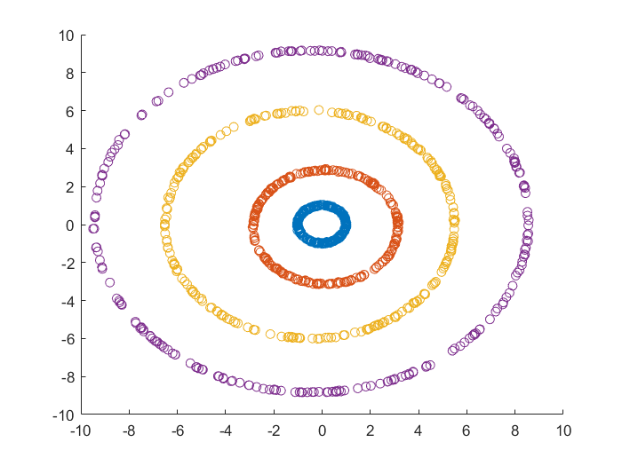
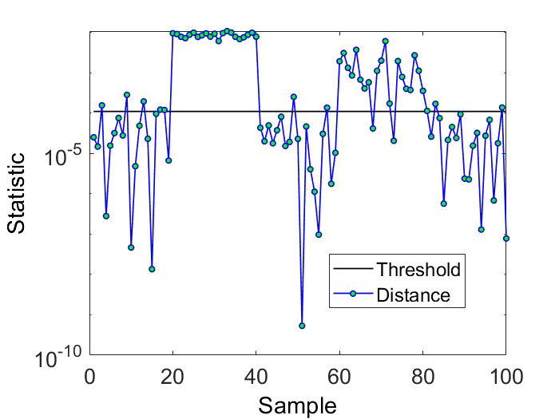
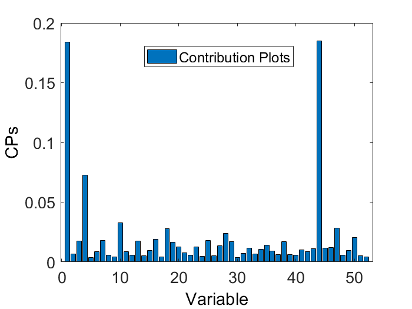

Kernel Principal Component Analysis(KPCA)  
===
---------------------------------------------------------
Updates in 18 Apr 2019	
1. Fixed some errors 
2. Added Dynamic KPCA(DKPCA)
---------------------------------------------------------  

four demos are provided:  
demo1: dimensionality reduction or feature extraction  
demo2: fault detection for a numerical example  
demo3: fault detection and fault diagnosis for TE process using KPCA  
demo4: fault detection and fault diagnosis for TE process using Dynamic KPCA(DKPCA)

demo1: dimensionality reduction, feature extraction  
=
    load circledata
    X = circledata;
    figure
    for i = 1:4
        scatter(X(1+250*(i-1):250*i,1),X(1+250*(i-1):250*i,2))
        hold on
    end

    % Train KPCA model
    model = kpca_train(X,'type',0,'sigma',5,'dims',2);

    % Visualize the result of dimensionality reduction
    figure
    for i = 1:4
        scatter(model.mappedX(1+250*(i-1):250*i,1), ... 
            model.mappedX(1+250*(i-1):250*i,2))
        hold on
    end
  
  
demo2: fault detection (Improve the performance of fault detection by adjusting parameters)  
=
    % Training data and Test data
    X = rand(200,10);
    Y = rand(100,10);
    Y(20:40,:) = rand(21,10)+3;
    Y(60:80,:) = rand(21,10)*3;

    % Train KPCA model
    model = kpca_train(X,'type',1,'sigma',60);

    % Test a new sample Y (vector of matrix)
    model = kpca_test(model,Y);

    % Plot the result
    plotResult(model.SPE_limit,model.SPE_test);
    plotResult(model.T2_limit,model.T2_test);
 
  
demo3: fault detection and fault diagnosis for TE process  
=
    % load TE process data
    load train
    load test

    % Normalization 
    [X, Y] = normalize(train,test);

    % Train KPCA model
    model = kpca_train(X,'type',1,'sigma',800,'fd',1);

    % Test a new sample Y (vector of matrix)
    model = kpca_test(model,Y);

    % Plot the result
    plotResult(model.SPE_limit,model.SPE_test);
    plotResult(model.T2_limit,model.T2_test);

    % Fault diagnosis
    [CPs_T2_test_s, CPs_SPE_test_s] = CPsKPCA(X,Y,model, ... 
        'start_time',300,'end_time',500,'theta',0.7);

    % Plot Contribution Plots
    plotCPs(CPs_SPE_test_s)
    plotCPs(CPs_T2_test_s)

